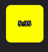
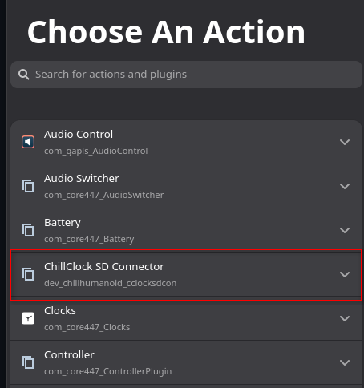
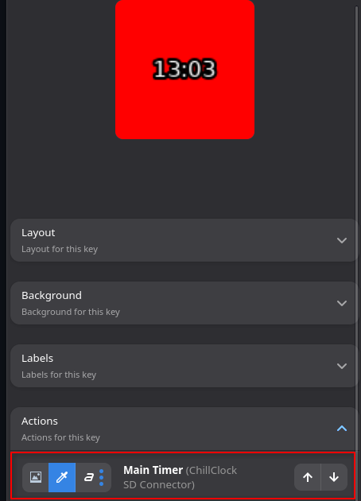
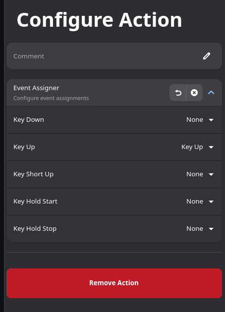
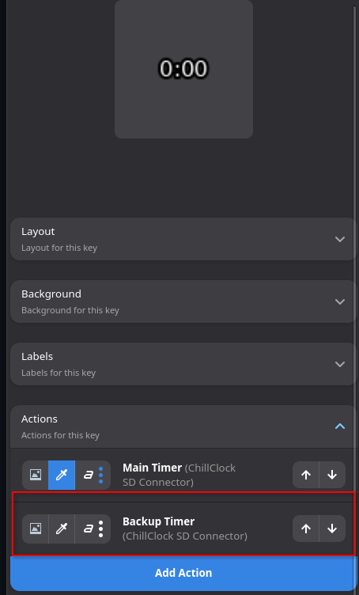
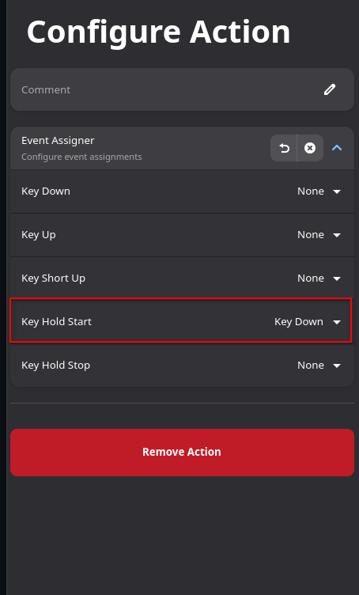

# ChillClock SD Connector

This is a plugin that connects with [ChillClock](https://github.com/unquenchedservant/ChillClock), a Dry-Herb Vape timer (specifically for the Solo 3, but may work for other DHV devices). This plugin was tested and verified to work with [StreamController](https://github.com/StreamController/StreamController), a Linux application that adds functionality to the Elgato StreamDeck. 




## Installation

In a terminal, run

```bash 
cd ~/.var/app/com.core447.StreamController/data/plugins
git clone https://github.com/unquenchedservant/ChillClockSDConnector
``` 

then restart the StreamController application.


In the StreamController application, on the button/page you want to make the ChillClock button, click the button and press "Add Action". Then find "ChillClock SD Connector" in the Action plugin list



Select "Main Timer", then on the button, under "Actions" click the "Main Timer" action listed to open it's configuration page



Click "Event Assigner" to open the dropdown and set all options to "None" except "Key Up" 



Once done, press "Back" to go back to the current button menu, then press "Add Action" again, and add the "Backup Timer" action under "ChillClock SD Connector". Click the "Backup Timer" action listed under "Actions" on the button menu to open the configuration page.



Click "Event Assigner" to open the dropdown and set all options to "None" except "Key Hold Start", set "Key Hold Start" to "Key Down"

 

## Usage
The button will display the appropriate color for the current stage.
- Stage 1 = Green
- Stage 2 = Yellow
- Stage 3 = Red

Clicking the button will either start the default timer or stop any timer. 

Long pressing the button will either start the secondary timer or stop any timer.